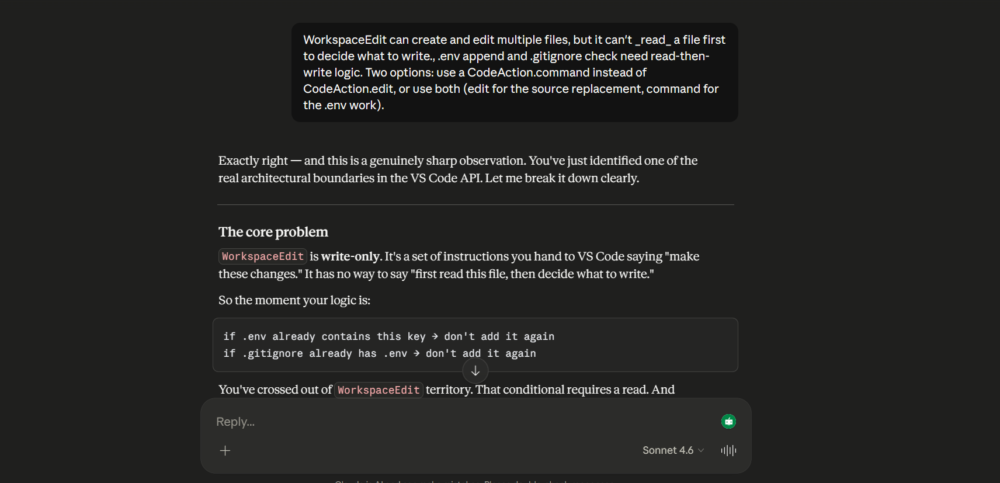
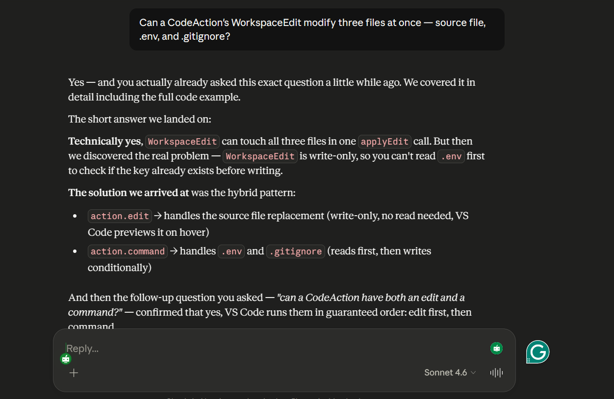
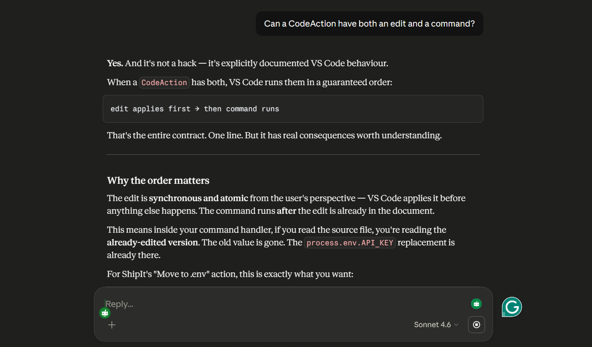

# ShipIt

A VS Code extension that reviews your code changes before you push. Catches the stuff you miss when you're tired — forgotten `console.log`s, hardcoded secrets, `debugger` statements, massive functions — and gives you a readiness score so you know if your code is good to go.

Most of the value works without an API key. The AI review is there if you want deeper analysis, but 7 static analyzers run locally and instantly.

---

## The Problem

On small teams, code ships without review. There's nobody awake to look at your PR at midnight. You push, and the next morning someone finds the `console.log` you left in, or worse, a hardcoded API key.

ShipIt sits between "I'm done coding" and `git push`. You run it, it tells you what's wrong, you fix it, you push. It's diff-aware — it only looks at what you changed, not the whole codebase — and it works offline with no setup.

**What it catches (no API key needed):**

- `console.log` / `console.warn` / `console.error` left in code
- `debugger` statements
- Hardcoded secrets, API keys, tokens (AWS, GitHub, generic patterns)
- `TODO` / `FIXME` / `HACK` comments you meant to resolve
- Functions that grew past 50 lines
- TypeScript `: any` usage
- `@ts-ignore` / `@ts-nocheck` directives

**What it does with those findings:**

- Inline diagnostics (the squiggly lines you're used to)
- Sidebar tree view grouped by file with risk levels
- CodeLens showing issue counts above functions
- Quick fixes via Ctrl+. (remove line, move secret to `.env`)
- A dashboard panel with a readiness score, issue breakdown, and a generated PR description you can copy-paste

If you add an OpenAI or Anthropic API key, it also sends your changes to an LLM for logic review — but it sends structured function-level context, not a raw diff dump.

---

## Install and Run from Source

You need VS Code (1.85+), Node.js (18+), and Git.

```bash
git clone https://github.com/AMIT1229/ShipIT.git
cd ShipIT
npm install
npm run build
```

Then open the folder in VS Code and press **F5**. This launches a new VS Code window with ShipIt active. Open any git repo in that window and run `ShipIt: Review My Changes` from the command palette (Ctrl+Shift+P).

To enable AI review (optional), add to your VS Code settings:

```json
{
  "shipit.apiKey": "your-key",
  "shipit.provider": "openai"
}
```

For development, `npm run watch` + F5 gives you hot reload.

---

## The Hardest Problem

**Diff parsing — specifically, line number tracking.**

Git's unified diff format looks straightforward. Lines start with `+` (added), `-` (removed), or ` ` (context). But mapping those back to actual file line numbers broke my diagnostics for a while.

The bug: removed lines don't exist in the new file, so they shouldn't increment the line counter. I was incrementing for all line types, which meant every diagnostic below a deletion was off by N (where N = number of deletions above it). A file with 3 deletions near the top would have every single diagnostic 3 lines too low.

```diff
@@ -10,6 +10,5 @@
 context line          ← line 10
-removed line          ← don't increment
-removed line          ← don't increment
+added line            ← this is line 11, not 13
 context line          ← line 12
```

Once I fixed that, I hit more edge cases: hunk headers that omit the line count when it's 1, `\ No newline at end of file` markers that look like content, `+++ /dev/null` for deleted files, renamed files that have two different header formats. Each one was a small puzzle.

I solved it by building the parser incrementally — got the simple case working first (one file, only additions), then fed increasingly weird diffs through it and fixed what broke. The key insight was simple once I had it: the line counter belongs to the _new_ file. Anything that doesn't exist in the new file shouldn't touch it.

---

## LLM Conversation

When building the quick-fix that moves a hardcoded secret to a `.env` file, I needed a single action to touch three files: replace the value in the source, append to `.env`, and update `.gitignore`. I wasn't sure how to do this with the VS Code CodeActionProvider API.

Here's the exchange (paraphrased):





The AI didn't write the code — it helped me understand a boundary in the API that isn't well-documented. I needed to know when `WorkspaceEdit` stops being useful and a command takes over.

---

## What I'd Do Next

1. **Tests** — core/ has zero VS Code imports, so it's straightforward to unit test. I'd start with diff-parser (most edge cases) and the analyzers (most business value). Chose to ship over test in 48 hours.

2. **Cross-file analysis** — right now each file is reviewed independently. The real bugs are at boundaries — change a function signature in one file, forget to update callers in another.

3. **Custom rules** — let users define their own patterns in settings. A regex, a message, a severity. Turns ShipIt into a team-specific tool.

4. **Local LLM** — Ollama support so code never leaves the machine. Architecture already supports it — just a new provider in `ai-reviewer.ts`.

5. **Review comparison** — diff between two runs. The history store already saves snapshots, it's mostly a UI problem.

---

## How I Used AI

I used AI tools throughout — mostly for exploring unfamiliar VS Code APIs (CodeLens, CodeActions, Webview security model) and generating regex patterns for the secret detector.

The architecture and scope decisions were mine: separating `core/` from `providers/` so the logic is testable without VS Code, making AI review optional so the tool works with zero setup, choosing which analyzers to build based on what I actually forget to clean up before pushing.

The reasoning is mine. The implementation was accelerated by AI.
